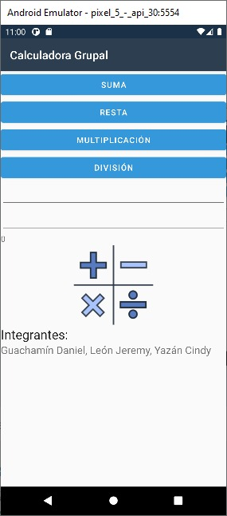
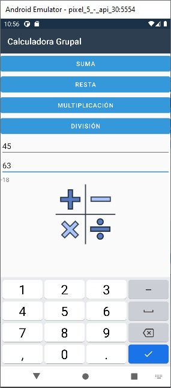
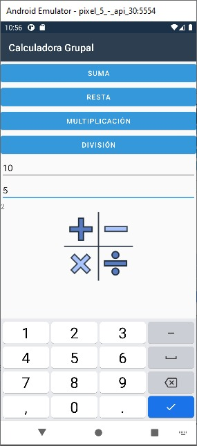

# Calculadora Básica

## Integrantes
* Guachamín Daniel
* León Jeremy
* Yazán Cindy

## Acerca del proyecto

    

El presente proyecto trata sobre la creación de una aplicación móvil en Xamarin Android Nativo. Se presenta una calculadora que realiza las operaciones básicas de suma, resta, multiplicación y división.

## Herramientas

* Este proyecto usa la herramienta [![XamarinForms][XamarinForms.com]][Xamarin-url]

## Capturas del proyecto 

Esta aplicación de Xamarin Android provee ejemplos del uso de la aplicación.

* SUMA

    

* RESTA

    

* MULTIPLICACIÓN

    

* DIVISIÓN

    

Validación de división para cero

    

[XamarinForms.com]: https://img.shields.io/badge/Xamarin-800080?style=for-the-badge&logo=xamarin&logoColor=white
[Xamarin-url]: https://docs.microsoft.com/en-us/xamarin/xamarin-forms/
